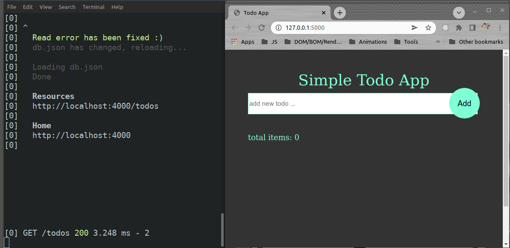

# Simple Todo App

**The project is intended for learning purposes only.**

Created with HTML, CSS and Vanilla JavaScript.

## Basic Functionality



## How to start
Open a Terminal and navigate to your projects folder
### clone the repo to local folder:
`git clone https://github.com/WWWCourses/todoApp_vanillaJS`

### navigate to root project folder:
`cd todoApp_vanillaJS`

### install dependencies
`npm install`

### create DB
create file 'db.json' in root project folder with next content:
```
{
	"todos": []
}
```
### start the json-server and live-server.
`npm run dev`

Remember, if you close the terminal (or kill the process, like pressing CTRL+C) the servers will stop.

## More info on NPM packages used:
### For Development:
* concurrently: [concurrently](https://www.npmjs.com/package/concurrently)
* json-server: [json-server](https://www.npmjs.com/package/json-server)
* live-server: [live-server](https://www.npmjs.com/package/live-server)